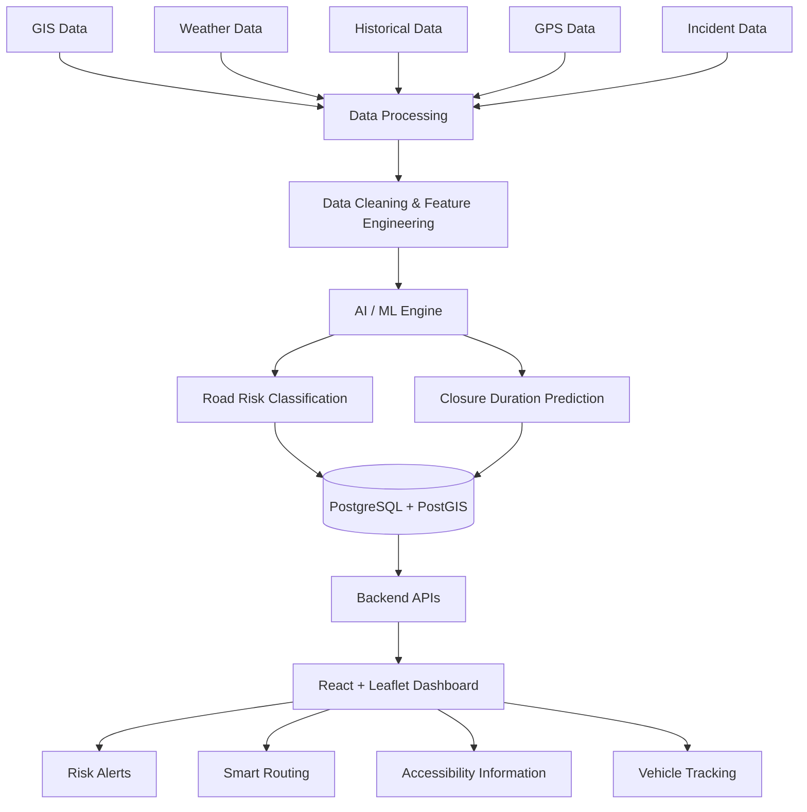
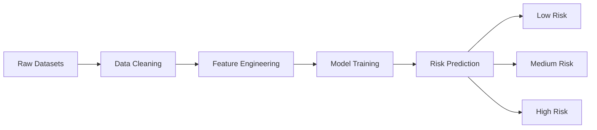
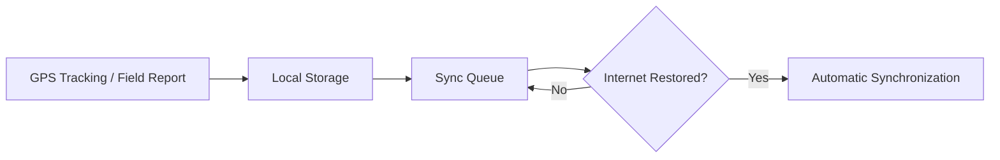

<div align="center">

# 🛣️ ResQ Byte

### AI-Powered Smart Logistics & Accessibility Intelligence Platform for the North Eastern Region

**Smart India Hackathon 2026 · Problem Statement SIH26002 · Ministry of Development of North Eastern Region (MDoNER)**

[🌐 Live Demo](https://ai-based-logistics-in-ner-7yto.vercel.app/) ·
[📂 GitHub Repository](https://github.com/SUSHANTH-GS-bit/AI-Based-Logistics-in-NER-)

<br>

**Connecting Data. Predicting Risk. Enabling Safer Logistics Across NER.**

<br>

[🚀 Live Prototype](https://ai-based-logistics-in-ner-7yto.vercel.app/) ·
[📌 Problem Statement](#-problem-statement) ·
[✨ Features](#-what-resq-byte-does) ·
[🏗️ Architecture](#️-system-architecture) ·
[⚡ Getting Started](#-getting-started)

</div>

---

## 📖 Table of Contents

1. [Problem Statement](#-problem-statement)
2. [The Vision](#-the-vision)
3. [What ResQ Byte Does](#-what-resq-byte-does)
4. [Live Demo](#-live-demo)
5. [System Architecture](#️-system-architecture)
6. [AI / ML Intelligence](#-ai--ml-intelligence)
7. [GIS & Spatial Intelligence](#️-gis--spatial-intelligence)
8. [Offline-First & Multilingual Support](#-offline-first--multilingual-support)
9. [Data Foundation](#-data-foundation)
10. [Technology Stack](#️-technology-stack)
11. [Repository Structure](#-repository-structure)
12. [Getting Started](#-getting-started)
13. [Screenshots](#️-screenshots)
14. [Roadmap](#-roadmap)
15. [Team](#-team)
16. [Acknowledgements & Data Sources](#-acknowledgements--data-sources)
17. [License](#-license)

---

## 🎯 Problem Statement

> **SIH26002** — *AI-Based Smart Logistics and Accessibility Intelligence Platform for the North Eastern Region (NER)*, sponsored by the **Ministry of Development of North Eastern Region (MDoNER)**.

The North Eastern Region faces recurring logistics and accessibility challenges caused by difficult terrain, extreme weather, and frequent road disruptions such as landslides, floods, and infrastructure gaps.

Essential goods including:

* Medicines
* Food
* Fuel
* Construction materials

can face delays while reaching remote districts.

ResQ Byte is designed as an integrated platform combining:

* Real-time logistics visibility
* Predictive disruption alerts
* Road-risk intelligence
* GIS-based visualization
* Smart route planning
* Vehicle tracking
* Accessibility information
* Offline field reporting
* Multilingual safety alerts

Landslide incidents in the NER have risen **~236% over eight years** — from 276 events in 2015–16 to 928 in 2023–24 — driven by factors including heavier monsoon rainfall, steep and fragile geology, deforestation, and climate change.

**ResQ Byte aims to convert this risk information into actionable logistics intelligence.**

---

## 🌏 The Vision

Build a connected intelligence layer for the NER that transforms scattered geographical and operational data into **clear, actionable information** for:

* Logistics
* Transportation
* Emergency accessibility
* Infrastructure monitoring
* Risk-aware route planning

<div align="center">

### Better Data → Smarter Decisions → Safer NER

</div>

---

## 🚀 What ResQ Byte Does

| Capability                              | Description                                                                                                         |
| :-------------------------------------- | :------------------------------------------------------------------------------------------------------------------ |
| 🧠 **AI Road-Risk Prediction**          | Predicts landslide and flood disruption risk for road segments using rainfall, slope, terrain, and historical data. |
| 🗺️ **Smart & Alternative Routing**     | Plans routes based on road risk and disruptions, not only distance.                                                 |
| 📍 **GIS Risk Visualization**           | Interactive visualization of roads, risk zones, and terrain across the 8 NER states.                                |
| 🚚 **Live Vehicle & GPS Tracking**      | Provides real-time visibility of essential-cargo vehicles moving through the region.                                |
| ⛰️ **Landslide & Closure Intelligence** | Uses historical landslide data, susceptibility zones, and road-closure information.                                 |
| 🏥 **Accessibility Mapping**            | Locates hospitals, warehouses, fuel stations, bridges, settlements, and other essential facilities.                 |
| 🌐 **Multilingual Safety Alerts**       | Supports English, Assamese, Khasi, Mizo, Meiteilon, Nagamese, Bodo, Nepali, and Bengali.                            |
| 📴 **Offline-First Field Reporting**    | Collects incident reports without connectivity and synchronizes them automatically after reconnection.              |

---

## 🔗 Live Demo

### Working Prototype

**[🌐 ai-based-logistics-in-ner-7yto.vercel.app](https://ai-based-logistics-in-ner-7yto.vercel.app/)**

> Deployed on Vercel. Best viewed on desktop for the full GIS map experience.

---

## 🏗️ System Architecture



### Architecture Flow

The system follows this pipeline:

**Data Sources → Data Processing → Feature Engineering → ML Engine → Spatial Database → Backend APIs → GIS Frontend**

The platform ingests geographical, weather, historical, and operational data, processes the information, generates road-risk predictions, stores spatial information, and displays the results through an interactive GIS dashboard.

---

## 🤖 AI / ML Intelligence

### ML Pipeline



### Machine Learning Models

| Model                          | Type                     | Prediction                             | Key Features                                                                        |
| :----------------------------- | :----------------------- | :------------------------------------- | :---------------------------------------------------------------------------------- |
| **Road-Risk Classifier**       | Random Forest / XGBoost  | Road segment risk: Low → Medium → High | 72h / 24h / 7d rainfall, slope, elevation, terrain, past incidents, surface quality |
| **Closure-Duration Predictor** | Random Forest Regression | Estimated road-closure duration        | Landslide volume, material, terrain, road importance, monsoon month                 |

The models are trained and validated using the `SetuNER_Dataset` module.

For methodology, feature definitions, and validation information, refer to:

```text
SetuNER_Dataset/README.md
```

---

## 🗺️ GIS & Spatial Intelligence

GIS forms the geographical foundation of ResQ Byte.

The platform represents:

* 🛣️ Road networks and risk zones
* ⛰️ Landslide locations
* 🌊 Flood incidents
* 🚨 Accident incidents
* 🏥 Hospitals
* 📦 Warehouses
* ⛽ Fuel stations
* 🌉 Bridges
* 🏘️ Settlements
* 🚚 Live vehicle locations

### GIS Technologies

| Technology     | Purpose                       |
| :------------- | :---------------------------- |
| **GeoJSON**    | Stores geographic datasets    |
| **PostGIS**    | Spatial database queries      |
| **Leaflet.js** | Interactive map visualization |
| **PostgreSQL** | Database management           |

PostGIS supports spatial operations such as:

* Distance calculations
* Location containment
* Nearest-neighbour queries
* Spatial filtering

---

## 📴 Offline-First & Multilingual Support

Connectivity can be unreliable across parts of the NER.

ResQ Byte therefore follows an **offline-first workflow**:



### Multilingual Safety Alerts

Alerts and warnings are designed to support:

* English
* Assamese
* Khasi
* Mizo
* Meiteilon
* Nagamese
* Bodo
* Nepali
* Bengali

---

## 📊 Data Foundation

| Dataset                  | Format  | Purpose                                                |
| :----------------------- | :------ | :----------------------------------------------------- |
| **States & Districts**   | GeoJSON | Geographic boundaries and locations                    |
| **Road Network**         | GeoJSON | Roads, segments, terrain, and slope information        |
| **Weather**              | CSV     | Rainfall and environmental conditions                  |
| **Road Risk**            | CSV     | Risk scoring and classification                        |
| **Incidents**            | GeoJSON | Landslide, flood, and accident reports                 |
| **Vehicles & GPS**       | JSON    | Vehicle movement and live locations                    |
| **Alerts**               | JSON    | Multilingual warning information                       |
| **Landslide History**    | CSV     | 2,834 historical landslide records (2015–2024)         |
| **Susceptibility Zones** | CSV     | Road-level landslide risk zoning using the NLSM method |
| **Road Closures**        | CSV     | Closure duration, impact, and restoration cost         |

### Dataset Documentation

Full methodology, validation, and dataset details:

```text
SetuNER_Dataset/README.md
```

---

## 🛠️ Technology Stack

| Category        | Technologies                                |
| :-------------- | :------------------------------------------ |
| **Languages**   | Python · JavaScript · SQL                   |
| **AI & Data**   | pandas · NumPy · scikit-learn · XGBoost     |
| **GIS**         | GeoJSON · Leaflet.js · PostGIS              |
| **Backend**     | Node.js · Express · FastAPI                 |
| **Database**    | PostgreSQL · PostGIS · SQLAlchemy           |
| **Frontend**    | React · Vite · Leaflet.js                   |
| **Deployment**  | Vercel                                      |
| **Development** | Git · GitHub · VS Code · Google Colab · npm |

---

## 📁 Repository Structure

```text
AI-Based-Logistics-in-NER-/
│
├── Frontend/
│   ├── src/
│   ├── public/
│   ├── package.json
│   └── vite.config.js
│
├── backend/
│   ├── src/
│   └── package.json
│
├── ML-ENGINEER/
│   ├── RainFall.ipynb
│   └── Road_Data_Set.ipynb
│
├── SetuNER_Dataset/
│   ├── frontend/
│   │   ├── districts/
│   │   ├── roads/
│   │   ├── incidents/
│   │   ├── vehicles/
│   │   ├── alerts/
│   │   └── landslides/
│   │
│   ├── backend/
│   │   ├── schema.sql
│   │   ├── seed.sql
│   │   └── server.js
│   │
│   ├── ml/
│   │   └── training datasets
│   │
│   ├── docs/
│   │   └── dataset documentation
│   │
│   └── README.md
│
├── data/
│   └── processed/
│       └── roads/
│
├── .env.example
├── .gitignore
└── README.md
```

---

## ⚡ Getting Started

### 1. Clone the Repository

```bash
git clone https://github.com/SUSHANTH-GS-bit/AI-Based-Logistics-in-NER-.git
cd AI-Based-Logistics-in-NER-
```

---

### 2. Frontend Setup

Open a terminal and run:

```bash
cd Frontend
npm install
npm run dev
```

---

### 3. Backend Setup

Open a **separate terminal**:

```bash
cd backend
npm install
npm run dev
```

---

### 4. Database Setup

For full backend functionality:

```bash
createdb resqbyte
```

Enable PostGIS:

```bash
psql -d resqbyte -c "CREATE EXTENSION postgis;"
```

Run the database schema:

```bash
psql -d resqbyte -f SetuNER_Dataset/backend/schema.sql
```

Insert the seed data:

```bash
psql -d resqbyte -f SetuNER_Dataset/backend/seed.sql
```

---

### 5. Machine Learning Environment

The ML notebooks are located in:

```text
ML-ENGINEER/
```

They can be executed using:

* Google Colab
* Local Python environment

Install the required Python packages:

```bash
pip install pandas numpy scikit-learn xgboost
```

---

### 6. Environment Variables

Create `.env` files from the provided template:

```text
.env.example
```

Add the required values such as:

```text
Database connection string
API keys
Other service configuration
```

Do not commit private credentials to GitHub.

---

## 🖼️ Screenshots

Add screenshots of the working platform here.

Recommended screenshots:

### Dashboard

```text
docs/screenshots/dashboard-overview.png
```

### Risk Map

```text
docs/screenshots/risk-map.png
```

### Vehicle Tracking

```text
docs/screenshots/vehicle-tracking.png
```

You can structure the screenshot directory as:

```text
docs/
└── screenshots/
    ├── dashboard-overview.png
    ├── risk-map.png
    └── vehicle-tracking.png
```

---

## 🔮 Roadmap

* [ ] Real-time weather and traffic feed integration
* [ ] IMD and CWC data integration
* [ ] Satellite-based landslide detection
* [ ] Government road-closure data integration
* [ ] SMS-based emergency notifications
* [ ] Advanced route optimization using OSRM / GraphHopper
* [ ] Additional regional languages
* [ ] Automated incident detection from field imagery
* [ ] Larger real historical dataset
* [ ] Deep-learning models for longer-horizon risk forecasting

---

## 👥 Team

| Role                        | Name                                               |
| :-------------------------- | :------------------------------------------------- |
| **Team Lead / ML**          | [Sushanth G S](https://github.com/SUSHANTH-GS-bit) |
| **Backend Developer**       | *Add name*                                         |
| **Frontend Developer**      | *Add name*                                         |
| **Mobile Developer**        | *Add name*                                         |
| **GIS / Routing**           | *Add name*                                         |
| **Presentation / Research** | *Add name*                                         |

<div align="center">

**Built for Smart India Hackathon 2026**

Under the **IGNITE Entrepreneurship Program**
**REVA University, Bengaluru**

</div>

---

## 🙏 Acknowledgements & Data Sources

ResQ Byte is designed to integrate with real-world geographical, weather, logistics, and multilingual data sources.

| Source                                                             | Purpose                                     |
| :----------------------------------------------------------------- | :------------------------------------------ |
| [India Meteorological Department (IMD)](https://mausam.imd.gov.in) | Rainfall and weather information            |
| [Geological Survey of India (GSI)](https://www.gsi.gov.in)         | Landslide records                           |
| [Central Water Commission (CWC)](https://cwc.gov.in)               | Flood forecasting                           |
| [OpenStreetMap](https://www.openstreetmap.org)                     | Road network and geographic data            |
| [Bhashini – Digital India](https://bhashini.gov.in)                | Multilingual AI and language technology     |
| [Smart India Hackathon](https://sih.gov.in)                        | Problem statement and hackathon information |

---

## 📄 License

No license file has been added to this repository yet.

If the project is intended for public distribution, add an appropriate `LICENSE` file to define how others may use, modify, and distribute the project.

---

<div align="center">

# 🛣️ ResQ Byte

### Connecting Data. Predicting Risk. Enabling Safer Logistics Across NER.

<br>

[🌐 Live Demo](https://ai-based-logistics-in-ner-7yto.vercel.app/) ·
[⭐ Star this Repository](https://github.com/SUSHANTH-GS-bit/AI-Based-Logistics-in-NER-)

<br><br>

**Smart India Hackathon 2026 · SIH26002**

</div>
